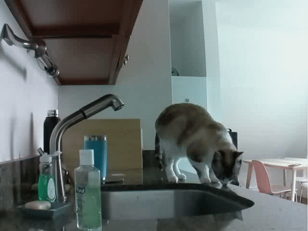
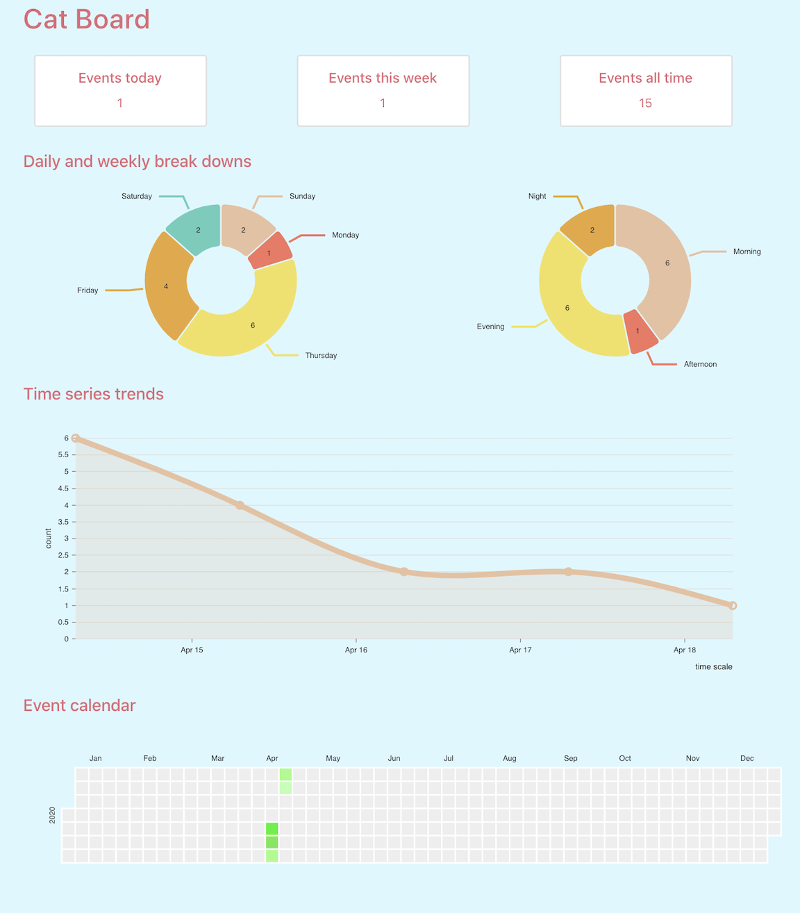
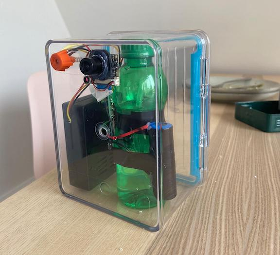
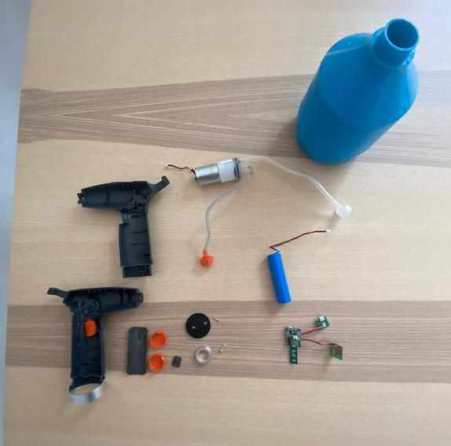
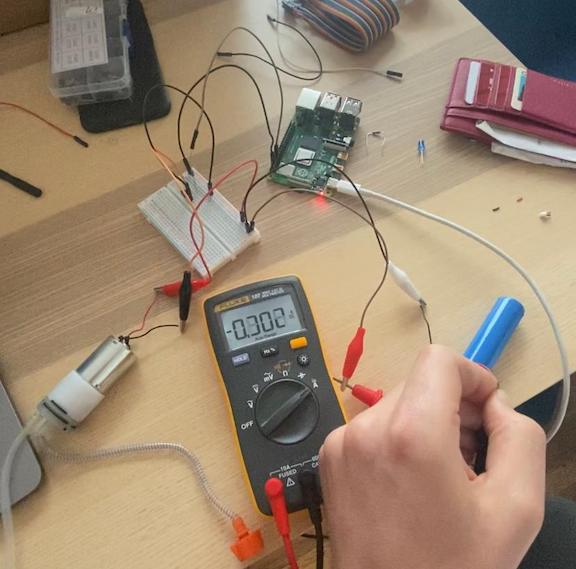

# Cat Sprayer

## Introduction

Recently I adopted a cat from a rescue center, who arrived with some bad habits. 
The worst of these was jumping onto the kitchen counter, risking getting hurt by the hot stove, 
or eating something dangerous for cats. In this problem, I saw an opportunity for a _pet_ project. 
My solution was to build an edge device that uses computer vision to detect when the cat is 
on the counter and give her a light spray of water. In addition to spraying the cat, the device will 
also send a message to my phone with a video clip of the event and log the event to an SQL database. 
The content of this database is visualized through a React frontend, highlighting changes in cat’s behavior 
over time (we’ve seen significant improvements to date). The ML detection, SQL database, Flask API and React 
application are all hosted on a single Raspberry Pi.

The computer vision model used in the application is an Object Detection algorithm, I started with a tensorflow lite
pre-trained quantized COCO SSD MobileNet v1 model, which is capable of classifying 90 common items, including cats.
A quantized model was employed to maximize fps on the Raspberry Pi. 

This repository contains all the code required to run the device and send video clips to your mobile device, 
although this will require that you also setup an AWS and Twilio account. 
The Twilio API is used to send the message while s3 is used to store clips and 
generate the pre-signed urls required for the Twilio api. 

Below is a sample gif, created from one of the video events that was sent to my phone! 

## Set-up

The project is highly configurable, everything can be controlled from config.py.

To run this code you should set up a virtual environment on your Raspberry Pi, then ensure that all environmental 
variables mentioned in env_setup are set and install all the requirements listed in requirements.txt. 

## [Cat Board](https://github.com/quinlivanb/cat_board)

An optional addition to this project is a React dashboard that can help your visualize if the behaviour of your 
cat is improving over time. Every time an event occurs the detection algorithm will log the current local time to an 
SQLite database. The information captured in this database is then exposed to the React front end via a very simple
Flask api. I have found that the Raspberry Pi 4 has no problem running both the detection algorithm and 
React application. 

Check out the [Cat Board](https://github.com/quinlivanb/cat_board) repository here! 

## The hardware 

A full list of hardware and instructions on how to build your own is coming soon, 
this will include a 3D model of the new enclosure which you can print for yourself! 

## The build 

Below is an image of the very first proto-type of the device. Here a simple food container 
is being used as the devices housing. The next iteration will use a custom 3D-printer housing with 
an integral water reservoir.

The water pump used in this project is a simple 3.7V pump/motor combo salvaged from an electric plant mister, 
I was also able to salvage the battery from this to act as a UPS and to provide the current required 
by the motor. When plugged into the wall the battery is trickle charged via an inexpensive charge controller.  

It was very important to test the current draw of the pump under full load so I could correctly spec out 
the hardware controller circuit. I could see the pump was drawing a max of 1.5 amps when there was a blockage at 
the water inlet of the pipe. In my prototype I'm controlling the motor with a Tip 120, this is controlled by pin 18
of the Raspberry Pi. It's important to include a 'fly back' diode across the motor to protect the Raspberry Pi and a 1k resistor 
on the pin controlling the Tip 120. It's also a good idea to use a 10k tie-down resistor to ensure the pump is not 
triggered during startup/shutdown of the Raspberry Pi. Circuit diagrams will be included soon!    

